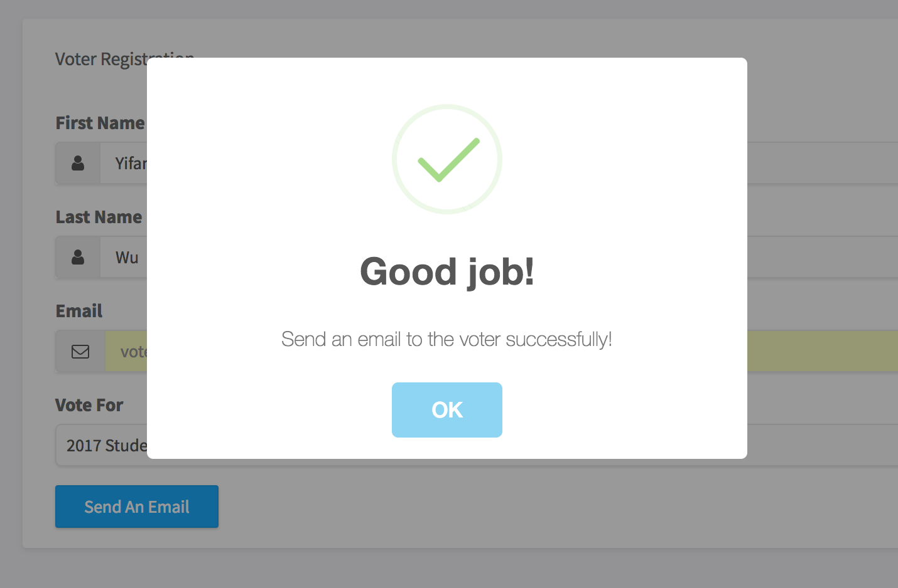
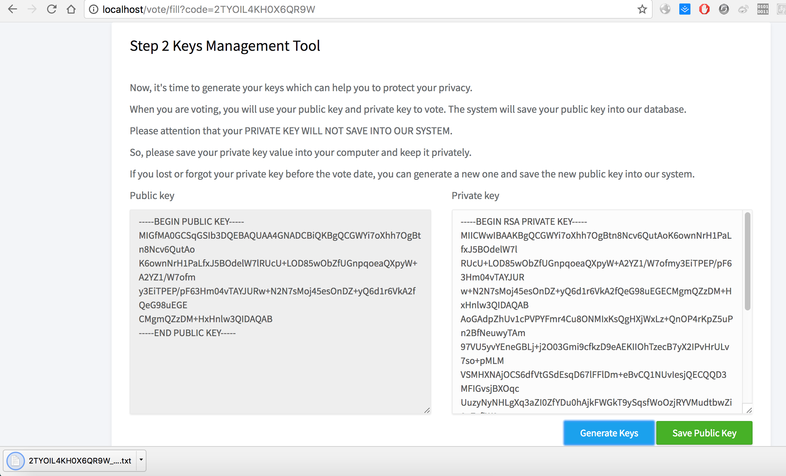
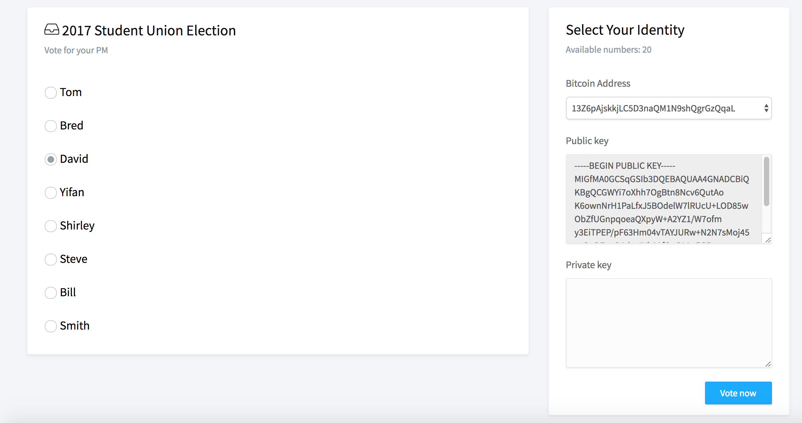
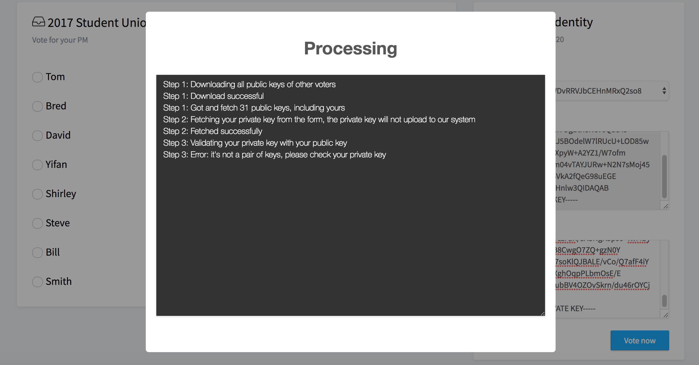
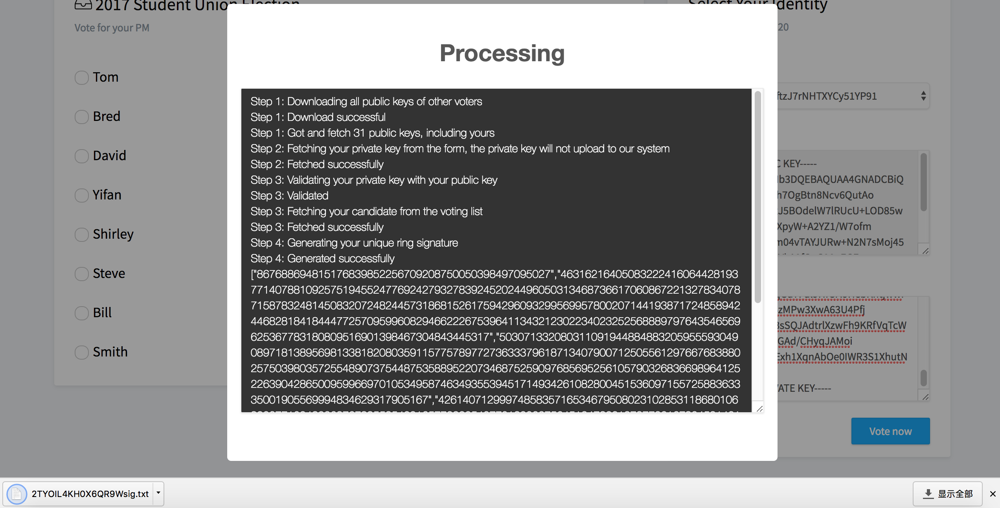
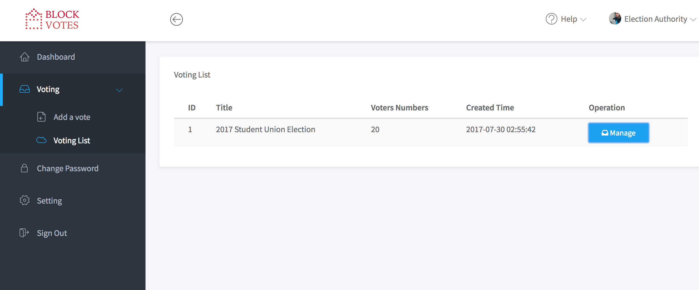

# BlockVotes
An e-voting system based on blockchain using ring signature

Demo: https://www.youtube.com/watch?v=4c6pQg3q4Vc

https://www.bilibili.com/video/av13430551/ 

### Topic

E-voting systems will be beneficial to all people who are involved in elections. For example, administrators can improve operation of tasks for elections, and voters can vote in an election anytime and anywhere. In addition, ideal e-voting systems have transparency, completeness (only voters have the right to vote and their votes are correctly counted), and verifiability (voters can check that their vote is correctly counted), and therefore it is better than existing voting system.

Digital voting is the use of electronic devices, such as voting machines or an internet browser, to cast votes. These are sometimes referred to as e-voting whenvoting using a machine in a polling station, and e-voting when using a web browser.

Security of digital voting is always the biggest concern when considering to implement a digitalvoting system. With such monumental decisions at stake, there can be no doubt about the system’s ability to secure data and defend against potential attacks. One way the security issues can be potentially solved is through the technology of blockchains.

Blockchain technology originates from the underlying architectural design of the crypto currency bitcoin. It is a form of distributed database where records take the form of transactions, a block is a collection of these transactions. With the use of blockchains a secure and robust system for digital voting can be devised. 

To solve the problem, I propose a way to use the ring signature and the blockchain to ensure the features of the e-voting. The blockchain technology is characterized by decentralization, irreversibility, distribution of joint accounting, asymmetric encryption and data-security.

### Terminology

For the e-voting system, we should keep these terminologies in mind:

**Privacy:**

- Ballot-privacy (BP): no outside observer can determine for whom a voter voted. keeping the ballot’s contents secret – while allowing voters to verify their vote counted towards the final result.
- Receipt-freeness (RF): a voter cannot prove after the election how she voted. These are systems that do not allow the voter to prove how she voted.
- Coercion-resistance (CR): a voter cannot interact with a coercer during the election to prove how she is voting.This property extends the notion of receipt freeness, by requiring protection against forced abstention, against forced randomised voting and against being forced to give up voter credentials.

**Verifiability:**

- Individual verifiability (IV): a voter can verify that the ballot containing her voteis in the published set of “all” (as claimed by the system) votes.
- Universal verifiability (UV): anyone can verify that the result corresponds with the published set of “all” votes.
- End-to-end verifiability: a voter can verify that:
  – cast-as-intended (CAI): her choice was correctly denoted on the ballot by the
  system,
  – recorded-as-cast (RAC): her ballot was received the way she cast it,– tallied-as-recorded (TAR): her ballot counts as received.

### Blockchain

The blockchain can be described as an immutable, cumulative ledger, with consensus protocol working to maintain this ledger of all valid transactions on every node in the network. 

**OP_RETURN**

OP_RETURN is a script opcode used to mark a transaction output as invalid. Since any outputs with OP_RETURN are provably unspendable, OP_RETURN outputs can be used to burn bitcoins.			

​	

### Ring Signature

1. A group of entities each have public/private key pairs, (*P*1, *S*1), (*P*2, *S*2), ..., (*Pn*, *Sn*). 
2. a ring signature: σ = (m, Si, P1,P2,……,Pn)
3. Anyone can check the validity of a ring signature given σ, *m*, and the public keys involved, *P*1, ..., *Pn*

### Tools & Framework

### The Protocol

** CONFIDENTIAL NOW ** 

It will release on Sep, 2017

### Screenshot

